<!-- README.md for github.com/justcarlson -->

---

## About Me

Technical Support Engineer learning to build with AI. Currently exploring MCP, AI agents, and infrastructure automation while running a homelab.

> *"It is never too late to be what you might have been."*  
> — George Eliot

---

🛠 Tech Stack

 

🏠 My Homelab

 

Multi-server Dokploy deployment with Tailscale mesh, running containerized apps on Proxmox VE with Traefik for SSL/routing.

📊 GitHub Stats

 

  

---

